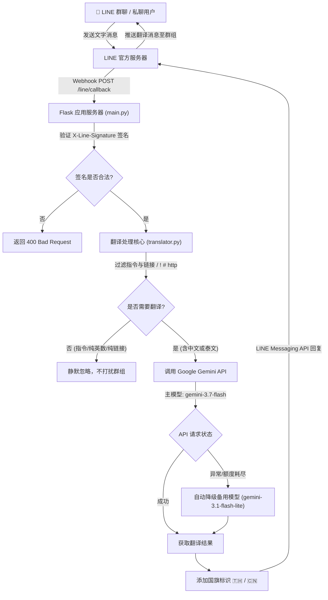

# 🌐 LINE 简体中文 ⇄ 泰语 实时双向翻译机器人 (LINE Translate Bot)

[🇹🇭 ภาษาไทย (README_TH.md)](./README_TH.md) | [🇨🇳 简体中文 (README.md)](./README.md)

基于 **Flask** 与 **Google Gemini 3.7 Flash** 构建的 LINE 智能翻译机器人。专为 **LINE 群聊 (Group Chat)** 与私聊场景深度优化，实现简体中文与泰语之间的自动语系识别与流畅双向翻译。

---

## 📑 目录
- [系统架构与业务流程](#-系统架构与业务流程)
- [项目目录结构](#-项目目录结构)
- [核心模块说明](#-核心模块说明)
- [环境变量配置 (.env)](#-环境变量配置-env)
  - [快速开始](#快速开始)
  - [变量说明](#变量说明)
  - [首次启动检查](#首次启动检查)
  - [换电脑时的设置](#换电脑时的设置)
  - [安全规则](#安全规则)
  - [如果密钥疑似泄露](#如果密钥疑似泄露)
  - [常见问题排查](#常见问题排查)
- [安装与启动指南](#-安装与启动指南)
- [LINE 群聊部署关键设置](#-line-群聊部署关键设置)
- [日常维护与测试命令](#-日常维护与测试命令)

---

## 🏗️ 系统架构与业务流程



---

## 📂 项目目录结构

```text
translate_bot/
├── config.py           # ⚙️ 全局配置与环境变量加载（含启动自检）
├── main.py             # 🚀 Webhook 服务器入口（Flask + LINE SDK v3）
├── translator.py       # 🧠 语言识别、群聊噪声过滤与 Gemini 3.7 Flash 翻译引擎
├── .env                # 🔑 本地敏感密钥配置（禁止提交至 Git）
├── .env.example        # 📝 环境变量配置模板
├── requirements.txt    # 📦 Python 依赖包清单
├── .gitignore          # 🚫 Git 忽略规则
├── README.md           # 📖 中文项目说明手册
└── README_TH.md        # 📖 คู่มือการใช้งานและโครงสร้างระบบภาษาไทย
```

---

## 🧩 核心模块说明

| 文件名 | 职责说明 |
| :--- | :--- |
| **`main.py`** | 1. 启动 Flask HTTP 服务，监听 `/line/callback`。<br>2. 验证 LINE 消息签名 (`X-Line-Signature`)。<br>3. 接收并解析 `MessageEvent`，调用翻译模块后通过 `reply_message` 自动回复。 |
| **`translator.py`** | 1. **语言判断**：通过正则表达式检测泰文字符 (`\u0e00-\u0e7f`) 与中文字符 (`\u4e00-\u9fa5`)。<br>2. **群聊降噪**：自动忽略以 `/`、`!`、`#` 开头的指令及网页链接，防止群聊刷屏。<br>3. **AI 翻译**：封装 `GeminiTranslator`，使用 `gemini-3.7-flash` 模型进行高质量中泰双向互译，内置备用模型故障自动转移。 |
| **`config.py`** | 1. 集中管理 LINE Token、Secret、Gemini API Key、模型名称及端口。<br>2. 提供 `validate_config()` 函数在启动时校验必要参数。 |

---

## 🔑 环境变量配置 (.env)

### 快速开始

第一次使用时，在项目目录执行：

```bash
cp .env.example .env
chmod 600 .env
```

用文本编辑器打开 `.env`，只在本机填写真实密钥。不要把真实密钥放入 README、Issue 或聊天记录。

### 变量说明

| 变量 | 必填 | 用途 | 从哪里取得/如何修改 |
| :--- | :--- | :--- | :--- |
| `LINE_CHANNEL_ACCESS_TOKEN` | 是 | LINE Messaging API 的访问令牌 | LINE Developers Console → Messaging API |
| `LINE_CHANNEL_SECRET` | 是 | 验证 LINE Webhook 签名 | LINE Developers Console → Basic settings |
| `GEMINI_API_KEY` | 是 | 调用 Google Gemini 翻译 | Google AI Studio |
| `GEMINI_MODEL` | 否 | 主要翻译模型；默认 `gemini-3.7-flash` | 修改 `.env` 中的模型名称 |
| `GEMINI_FALLBACK_MODEL` | 否 | 主模型失败时使用的备用模型；默认 `gemini-3.1-flash-lite` | 修改 `.env` 中的模型名称 |
| `SERVER_HOST` | 否 | 服务监听地址；默认 `0.0.0.0` | 通常保持默认值 |
| `SERVER_PORT` | 否 | 服务端口；默认 `8000` | 端口被占用时修改为其他数字 |

### 首次启动检查

先检查必要配置，再启动机器人：

```bash
./venv/bin/python -c "import config; config.validate_config()"
./venv/bin/python main.py
```

如果提示缺少变量，请回到 `.env` 补齐前三个必填值。检查时不要打印或复制密钥内容。

### 换电脑时的设置

在新电脑上克隆项目并创建本地配置：

```bash
git clone https://github.com/maccelectronic/macc-line-translate-bot.git
cd macc-line-translate-bot
cp .env.example .env
chmod 600 .env
```

然后从密码管理器或安全备份中恢复密钥到 `.env`。GitHub 仓库故意不包含 `.env`，所以不能从 GitHub 下载密钥。

### 安全规则

- 永远不要执行 `git add .env`；提交前用 `git status` 确认 `.env` 未被追踪。
- 可用以下命令检查 `.env` 是否被忽略，不会显示密钥值：
  ```bash
  git status --ignored --short .env
  ```
- 不要把密钥粘贴到 README、Issue、聊天或截图中。
- 如果权限不是仅所有者可读写，请执行 `chmod 600 .env`。

### 如果密钥疑似泄露

立即在 LINE Developers Console 和 Google AI Studio 撤销并重新生成对应密钥，更新本机 `.env` 后重启机器人。如果密钥曾经提交到 Git，不能只删除文件，必须先轮换密钥并清理 Git 历史。

### 常见问题排查

- `.env` 不存在：重新执行 `cp .env.example .env`。
- 必填值为空：填写 `LINE_CHANNEL_ACCESS_TOKEN`、`LINE_CHANNEL_SECRET` 和 `GEMINI_API_KEY`，然后重新运行配置检查。
- 权限过宽：执行 `chmod 600 .env`。
- 端口被占用：修改 `SERVER_PORT`，再重新启动。

下面是完整配置示例（仅使用占位符，不要直接填入真实密钥）：

## 🚀 安装与启动指南

### 1. 创建虚拟环境并安装依赖
```bash
cd /home/ubuntu/Desktop/translate_bot

# 创建 Python 虚拟环境 (如未创建)
python3 -m venv venv

# 安装依赖
./venv/bin/pip install -r requirements.txt
```

### 2. 前台启动测试
```bash
./venv/bin/python main.py
```

### 3. 后台守护运行 (nohup 方式)
```bash
# 后台启动并将日志写入 bot.log
nohup ./venv/bin/python main.py > bot.log 2>&1 &

# 查看实时运行日志
tail -f bot.log

# 检查运行进程
ps aux | grep main.py
```

---

## 📌 LINE 群聊部署关键设置

在 [LINE Official Account Manager](https://manager.line.biz/) 后台务必确认以下 3 项设置：

1. **允许加入群组**：
   - 路径：**设置 (Settings)** -> **账号设置 (Account settings)** -> 开启 **「允许加入群组或多人聊天室 (Allow bot to join group chats)」**。
2. **关闭官方自动回复**：
   - 路径：**回应设置 (Response settings)** -> 响应模式选择 **「聊天机器人 (Bot)」** -> 将 **「自动回应消息 (Auto-reply messages)」关闭 (OFF)**（避免用户在群里发言时触发 LINE 默认罐头回复）。
3. **启用 Webhook**：
   - 路径：在 LINE Developers Console -> Messaging API 页面，开启 **「Use webhook」**，填入公网地址（如 `https://your-domain.com/line/callback`），点击 **Verify** 确认联通。

---

## 🛠️ 日常维护与测试命令

- **测试环境变量与模型读取**：
  ```bash
  ./venv/bin/python -c "import config; print('当前模型:', config.GEMINI_MODEL)"
  ```
- **测试翻译函数**：
  ```bash
  ./venv/bin/python -c "from translator import translate_message; print(translate_message('สวัสดีครับ ยินดีที่ได้รู้จัก'))"
  ```
