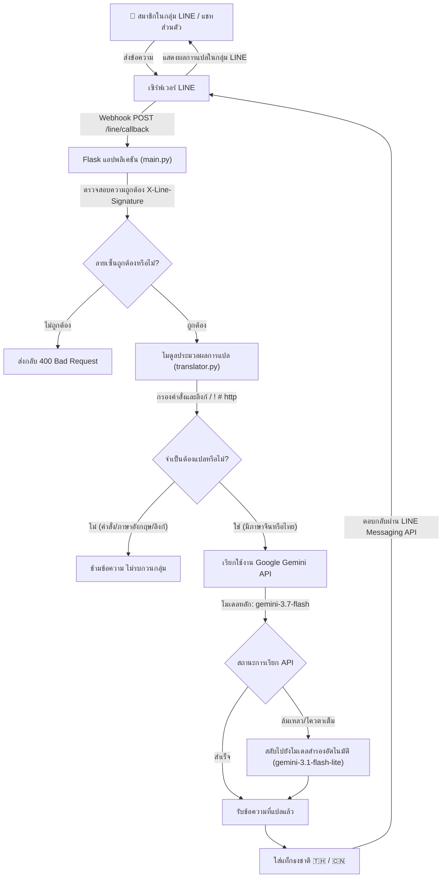

# 🌐 บอตแปลภาษาแบบเรียลไทม์ จีนตัวย่อ ⇄ ไทย บน LINE (LINE Translate Bot)

[🇹🇭 ภาษาไทย (README_TH.md)](./README_TH.md) | [🇨🇳 简体中文 (README.md)](./README.md)

บอตแปลภาษาอัจฉริยะบน LINE พัฒนาด้วย **Flask** และ **Google Gemini 3.7 Flash** ออกแบบและปรับแต่งมาเป็นพิเศษสำหรับ **กลุ่ม LINE (Group Chat)** และการแชทส่วนตัว สามารถตรวจจับภาษาไทยและภาษาจีนตัวย่อได้อัตโนมัติ พร้อมแปลสองทิศทางได้อย่างแม่นยำและเป็นธรรมชาติ

---

## 📑 สารบัญ (Table of Contents)
- [โครงสร้างระบบและขั้นตอนการทำงาน (Architecture & Workflow)](#-โครงสร้างระบบและขั้นตอนการทำงาน-architecture--workflow)
- [โครงสร้างไดเรกทอรีโปรเจกต์ (Project Structure)](#-โครงสร้างไดเรกทอรีโปรเจกต์-project-structure)
- [คำอธิบายโมดูลหลัก (Core Modules)](#-คำอธิบายโมดูลหลัก-core-modules)
- [การตั้งค่าตัวแปรสภาพแวดล้อม (.env)](#-การตั้งค่าตัวแปรสภาพแวดล้อม-env)
  - [เริ่มต้นใช้งาน](#เริ่มต้นใช้งาน)
  - [คำอธิบายตัวแปร](#คำอธิบายตัวแปร)
  - [ตรวจสอบก่อนเริ่มครั้งแรก](#ตรวจสอบก่อนเริ่มครั้งแรก)
  - [เมื่อติดตั้งบนคอมพิวเตอร์เครื่องใหม่](#เมื่อติดตั้งบนคอมพิวเตอร์เครื่องใหม่)
  - [กฎความปลอดภัย](#กฎความปลอดภัย)
  - [หากสงสัยว่าคีย์รั่วไหล](#หากสงสัยว่าคีย์รั่วไหล)
  - [การแก้ปัญหาที่พบบ่อย](#การแก้ปัญหาที่พบบ่อย)
- [คู่มือการติดตั้งและเริ่มใช้งาน (Installation & Setup)](#-คู่มือการติดตั้งและเริ่มใช้งาน-installation--setup)
- [การตั้งค่าสำคัญสำหรับกลุ่ม LINE (LINE Group Chat Settings)](#-การตั้งค่าสำคัญสำหรับกลุ่ม-line-line-group-chat-settings)
- [คำสั่งสำหรับทดสอบและบำรุงรักษา (Maintenance Commands)](#-คำสั่งสำหรับทดสอบและบำรุงรักษา-maintenance-commands)

---

## 🏗️ โครงสร้างระบบและขั้นตอนการทำงาน (Architecture & Workflow)



---

## 📂 โครงสร้างไดเรกทอรีโปรเจกต์ (Project Structure)

```text
translate_bot/
├── config.py           # ⚙️ โหลดการตั้งค่าและตัวแปรสภาพแวดล้อม (พร้อมระบบตรวจสอบ)
├── main.py             # 🚀 จุดเริ่มต้นของเซิร์ฟเวอร์ Webhook (Flask + LINE SDK v3)
├── translator.py       # 🧠 ตรวจจับภาษา, กรองคำสั่ง, และแปลภาษาผ่าน Gemini 3.7 Flash
├── .env                # 🔑 ไฟล์เก็บคีย์และข้อมูลสำคัญ (ห้ามอัปโหลดขึ้น Git)
├── .env.example        # 📝 ไฟล์ตัวอย่างการตั้งค่าตัวแปรสภาพแวดล้อม
├── requirements.txt    # 📦 รายการแพ็กเกจ Python ที่จำเป็น
├── .gitignore          # 🚫 รายการไฟล์ที่ Git จะเพิกเฉย
├── README.md           # 📖 คู่มือการใช้งานภาษาจีน (简体中文)
└── README_TH.md        # 📖 คู่มือการใช้งานและโครงสร้างระบบภาษาไทย (ภาษาไทย)
```

---

## 🧩 คำอธิบายโมดูลหลัก (Core Modules)

| ชื่อไฟล์ | หน้าที่และความรับผิดชอบ |
| :--- | :--- |
| **`main.py`** | 1. รันเซิร์ฟเวอร์ Flask รับการเชื่อมต่อ Webhook ที่เส้นทาง `/line/callback`<br>2. ตรวจสอบลายเซ็นดิจิทัลของ LINE (`X-Line-Signature`)<br>3. รับเหตุการณ์ข้อความ (`MessageEvent`) เรียกฟังก์ชันแปล และตอบกลับผ่าน `reply_message` |
| **`translator.py`** | 1. **ตรวจจับภาษา**: ใช้ Regular Expression ตรวจหาตัวอักษรไทย (`\u0e00-\u0e7f`) และจีน (`\u4e00-\u9fa5`)<br>2. **ลดสัญญาณรบกวนในกลุ่ม**: กรองและข้ามข้อความที่ขึ้นต้นด้วย `/`, `!`, `#` และลิงก์ URL อัตโนมัติ<br>3. **AI แปลภาษา**: คลาส `GeminiTranslator` ใช้โมเดล `gemini-3.7-flash` แปลระหว่างจีนตัวย่อและไทยอย่างแม่นยำ พร้อมระบบ Fallback สลับโมเดลสำรองเมื่อเกิดข้อผิดพลาด |
| **`config.py`** | 1. รวบรวมการตั้งค่า Token, Secret, API Key, ชื่อโมเดล และหมายเลขพอร์ต<br>2. ฟังก์ชัน `validate_config()` ตรวจสอบว่าคีย์สำคัญครบถ้วนหรือไม่ก่อนเริ่มทำงาน |

---

## 🔑 การตั้งค่าตัวแปรสภาพแวดล้อม (.env)

### เริ่มต้นใช้งาน

ครั้งแรกให้รันคำสั่งต่อไปนี้ในโฟลเดอร์โปรเจกต์:

```bash
cp .env.example .env
chmod 600 .env
```

เปิดไฟล์ `.env` ด้วยโปรแกรมแก้ไขข้อความ แล้วใส่คีย์จริงเฉพาะในเครื่องของคุณ ห้ามใส่คีย์จริงใน README, Issue หรือแชท

### คำอธิบายตัวแปร

| ตัวแปร | จำเป็น | ใช้ทำอะไร | รับค่าจากที่ไหน/แก้ไขอย่างไร |
| :--- | :--- | :--- | :--- |
| `LINE_CHANNEL_ACCESS_TOKEN` | ใช่ | โทเคนสำหรับ LINE Messaging API | LINE Developers Console → Messaging API |
| `LINE_CHANNEL_SECRET` | ใช่ | ตรวจสอบลายเซ็นของ LINE Webhook | LINE Developers Console → Basic settings |
| `GEMINI_API_KEY` | ใช่ | เรียกใช้ Google Gemini เพื่อแปลภาษา | Google AI Studio |
| `GEMINI_MODEL` | ไม่ | โมเดลหลัก; ค่าเริ่มต้น `gemini-3.7-flash` | แก้ชื่อโมเดลใน `.env` |
| `GEMINI_FALLBACK_MODEL` | ไม่ | โมเดลสำรองเมื่อโมเดลหลักล้มเหลว; ค่าเริ่มต้น `gemini-3.1-flash-lite` | แก้ชื่อโมเดลใน `.env` |
| `SERVER_HOST` | ไม่ | ที่อยู่สำหรับรับการเชื่อมต่อ; ค่าเริ่มต้น `0.0.0.0` | โดยทั่วไปให้ใช้ค่าเดิม |
| `SERVER_PORT` | ไม่ | พอร์ตของเซิร์ฟเวอร์; ค่าเริ่มต้น `8000` | เปลี่ยนเป็นเลขอื่นหากพอร์ตถูกใช้งาน |

### ตรวจสอบก่อนเริ่มครั้งแรก

ตรวจสอบค่าที่จำเป็นก่อน แล้วจึงเริ่มบอต:

```bash
./venv/bin/python -c "import config; config.validate_config()"
./venv/bin/python main.py
```

หากแจ้งว่าขาดตัวแปร ให้กลับไปเติมค่าสามรายการที่จำเป็นใน `.env` อย่าแสดงหรือคัดลอกเนื้อหาคีย์ระหว่างตรวจสอบ

### เมื่อติดตั้งบนคอมพิวเตอร์เครื่องใหม่

โคลนโปรเจกต์และสร้างไฟล์ตั้งค่าในเครื่องใหม่:

```bash
git clone https://github.com/maccelectronic/macc-line-translate-bot.git
cd macc-line-translate-bot
cp .env.example .env
chmod 600 .env
```

จากนั้นกู้คืนคีย์ลงใน `.env` จากตัวจัดการรหัสผ่านหรือแบ็กอัปที่ปลอดภัยเท่านั้น GitHub ตั้งใจไม่เก็บไฟล์ `.env` จึงดาวน์โหลดคีย์จาก GitHub ไม่ได้

### กฎความปลอดภัย

- ห้ามรัน `git add .env` เด็ดขาด ก่อน commit ให้ใช้ `git status` ตรวจว่า `.env` ไม่ได้ถูกติดตาม
- ตรวจสอบว่า `.env` ถูก ignore โดยไม่แสดงค่าคีย์ด้วยคำสั่ง:
  ```bash
  git status --ignored --short .env
  ```
- ห้ามวางคีย์ใน README, Issue, แชท หรือภาพหน้าจอ
- หากสิทธิ์ไฟล์ไม่ใช่เจ้าของอ่านและเขียนได้เท่านั้น ให้รัน `chmod 600 .env`

### หากสงสัยว่าคีย์รั่วไหล

ให้ยกเลิกและสร้างคีย์ใหม่ทันทีใน LINE Developers Console และ Google AI Studio จากนั้นอัปเดต `.env` ในเครื่องและรีสตาร์ตบอต หากคีย์เคยถูก commit เข้า Git อย่าลบไฟล์อย่างเดียว ต้องเปลี่ยนคีย์และล้างประวัติ Git ด้วย

### การแก้ปัญหาที่พบบ่อย

- ไม่พบ `.env`: รัน `cp .env.example .env` อีกครั้ง
- ค่าที่จำเป็นว่าง: เติม `LINE_CHANNEL_ACCESS_TOKEN`, `LINE_CHANNEL_SECRET` และ `GEMINI_API_KEY` แล้วตรวจสอบใหม่
- สิทธิ์กว้างเกินไป: รัน `chmod 600 .env`
- พอร์ตถูกใช้งานอยู่: เปลี่ยน `SERVER_PORT` แล้วเริ่มใหม่

ด้านล่างคือตัวอย่างการตั้งค่าครบทุกตัว (เป็นเพียงค่าตัวอย่าง ห้ามใส่คีย์จริงลงในเอกสาร):

## 🚀 คู่มือการติดตั้งและเริ่มใช้งาน (Installation & Setup)

### 1. สร้าง Virtual Environment และติดตั้งแพ็กเกจ
```bash
cd /home/ubuntu/Desktop/translate_bot

# สร้างสภาพแวดล้อมเสมือนของ Python (หากยังไม่มี)
python3 -m venv venv

# ติดตั้งไลบรารีที่จำเป็น
./venv/bin/pip install -r requirements.txt
```

### 2. รันเพื่อทดสอบเบื้องต้น
```bash
./venv/bin/python main.py
```

### 3. รันเป็น Background Service ด้วย nohup
```bash
# รันเบื้องหลังและบันทึก Log ลงไฟล์ bot.log
nohup ./venv/bin/python main.py > bot.log 2>&1 &

# ดู Log แบบเรียลไทม์
tail -f bot.log

# ตรวจสอบสถานะการทำงานของ Process
ps aux | grep main.py
```

---

## 📌 การตั้งค่าสำคัญสำหรับกลุ่ม LINE (LINE Group Chat Settings)

เพื่อให้บอตทำงานในกลุ่ม LINE ได้อย่างราบรื่น กรุณาตรวจสอบการตั้งค่า 3 จุดใน [LINE Official Account Manager](https://manager.line.biz/):

1. **อนุญาตให้บอตเข้ากลุ่ม (Allow bot to join group chats)**:
   - ไปที่ **ตั้งค่า (Settings)** -> **ตั้งค่าบัญชี (Account settings)** -> เปิดใช้งาน **「อนุญาตให้เข้าร่วมกลุ่มหรือการสนทนาหลายคน (Allow bot to join group chats)」**
2. **ปิดข้อความตอบกลับอัตโนมัติ (Auto-reply messages)**:
   - ไปที่ **ตั้งค่าการตอบกลับ (Response settings)** -> เลือกโหมดการตอบกลับเป็น **「บอต (Bot)」** -> ปิด **「ข้อความตอบกลับอัตโนมัติ (Auto-reply messages) ให้เป็น OFF」** เพื่อป้องกันข้อความตอบกลับอัตโนมัติรบกวนสมาชิกในกลุ่ม
3. **เปิดใช้งาน Webhook**:
   - ในหน้า LINE Developers Console -> Messaging API ให้เปิด **「Use webhook」** และกรอก URL ที่เข้าถึงได้จากภายนอก (เช่น `https://your-domain.com/line/callback`) จากนั้นกด **Verify** เพื่อทดสอบการเชื่อมต่อ

---

## 🛠️ คำสั่งสำหรับทดสอบและบำรุงรักษา (Maintenance Commands)

- **ทดสอบการโหลด Config และโมเดล**:
  ```bash
  ./venv/bin/python -c "import config; print('โมเดลปัจจุบัน:', config.GEMINI_MODEL)"
  ```
- **ทดสอบฟังก์ชันการแปลภาษา**:
  ```bash
  ./venv/bin/python -c "from translator import translate_message; print(translate_message('สวัสดีครับ ยินดีที่ได้รู้จัก'))"
  ```
